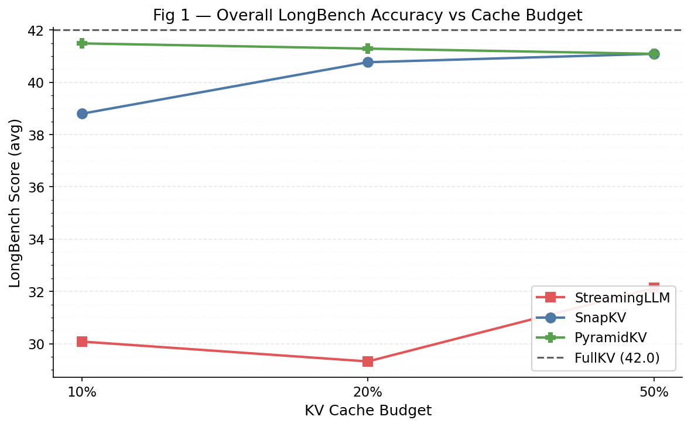
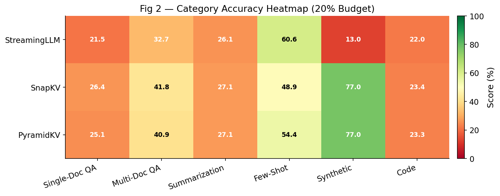
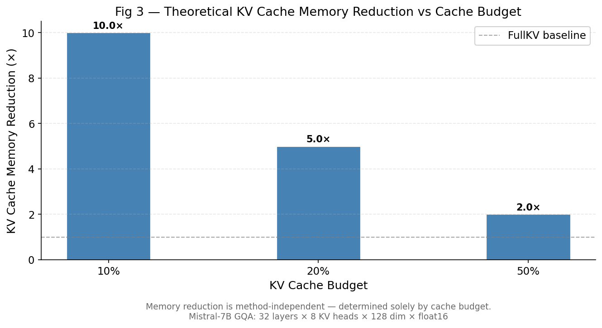
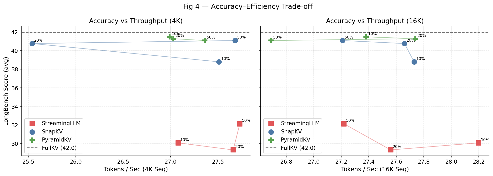
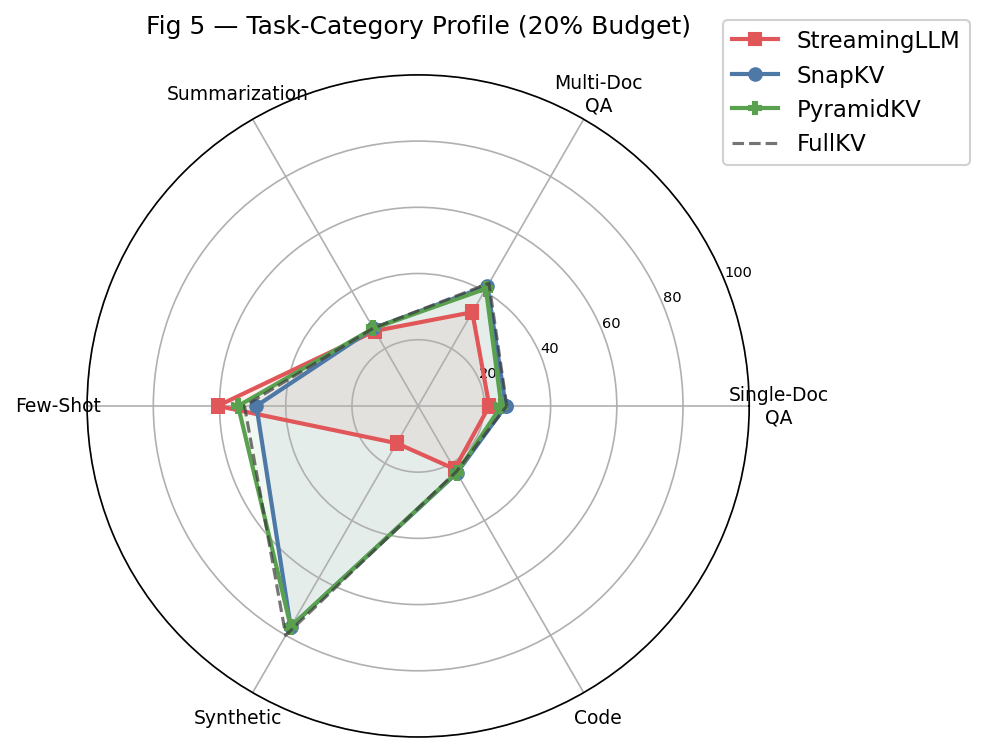

# Analysis of KV Cache Compression Policies

> **Course:** CSE 291 — Systems for Machine Learning
> **Date:** March 08, 2026

---

## Table of Contents

1. [Introduction](#1-introduction)
2. [Survey of KV Cache Compression Techniques](#2-survey-of-kv-cache-compression-techniques)
   - 2.1 [H2O — Heavy-Hitter Oracle](#21-h2o--heavy-hitter-oracle)
   - 2.2 [StreamingLLM](#22-streamingllm)
   - 2.3 [SnapKV](#23-snapkv)
   - 2.4 [PyramidKV](#24-pyramidkv)
3. [Unified Testbed Setup](#3-unified-testbed-setup)
4. [Evaluation Results](#4-evaluation-results)
5. [Analysis & Discussion](#5-analysis--discussion)
6. [Conclusion](#6-conclusion)
7. [References](#7-references)

---

## 1. Introduction

Modern large language models (LLMs) store a **Key-Value (KV) cache** during inference that
holds all intermediate attention states for every token processed so far. This cache grows
linearly with sequence length and can consume tens of gigabytes of GPU memory for long
documents, making it a critical bottleneck for long-context inference.

Formally, for a Transformer with $L$ layers, $H$ attention heads, and head dimension $d$,
the KV cache for a sequence of length $N$ requires

$$
\text{Memory} = 2 \times L \times H \times d \times N \times \text{sizeof}(\text{dtype})
$$

bytes. At `float16`, Mistral-7B GQA with $L=32, H_{kv}=8, d=128$ uses roughly
$2 \times 32 \times 8 \times 128 \times N \times 2 = 131{,}072 \times N$ bytes per
token — approximately **125 MB for a 31K-token context**, and far more for longer contexts.

**KV cache compression** methods aim to maintain as much accuracy as possible while retaining
only a *budget* of $K \ll N$ tokens in the cache at each layer. This report:

1. Surveys three evaluated methods (StreamingLLM, SnapKV, PyramidKV) and one excluded baseline (H2O, OOM).
2. Describes our unified experimental testbed built on [KVCache-Factory](https://github.com/Zefan-Cai/KVCache-Factory).
3. Evaluates all methods on **LongBench v1** across 6 representative datasets (one per task category)
   at cache budgets of **10%, 20%, and 50%** of the full context.
4. Provides theoretical and empirical analysis of each method's strengths and weaknesses.

---

## 2. Survey of KV Cache Compression Techniques

All four methods implement *token-dropping* (eviction) strategies: they select which KV
pairs to keep in the cache and discard the rest. They differ in **which tokens they evict**,
**when eviction occurs** (prompt vs. generation phase), and **how they allocate the budget
across layers**.

### 2.1 H2O

**Paper:** Zhang et al., *H2O: Heavy-Hitter Oracle for Efficient Generative Inference of
Large Language Models*, NeurIPS 2023.

**Note**: H2O was initially included but excluded from evaluation: it requires materializing the full attention weight matrix, which is compatible with the customized KVCache-Factory SDPA backend at long context lengths and caused OOM errors on all tested datasets. The eviction mechanism is briefly described in the references.

---

### 2.2 StreamingLLM

**Paper:** Xiao et al., *Efficient Streaming Language Models with Attention Sinks*, ICLR 2024.

#### Mechanism

StreamingLLM exploits the **attention sink** phenomenon: LLMs reliably attend to the
very first few tokens regardless of their semantic content. Without these sink tokens,
the softmax distribution over the remaining window becomes miscalibrated and model outputs
degrade catastrophically.

StreamingLLM maintains a fixed-size cache comprising:
- **Sink tokens** — the first $k_s$ tokens (typically 4) of the sequence, always kept.
- **Sliding window** — the most recent $K - k_s$ tokens.

All other tokens are permanently evicted once they fall out of the window.


$$
\text{Cache}_t = \underbrace{[t_1, \ldots, t_{k_s}]}_{\text{sinks}} \cup \underbrace{[t_{t-W+1}, \ldots, t_t]}_{\text{recent window}}
$$


#### Theoretical Justification

The attention sink hypothesis is supported by visualizations showing that the attention
distribution is bimodal: high weight on the initial $k_s$ tokens and high weight on recent
tokens, with mid-context tokens receiving near-zero attention. This makes the sliding window
a natural approximation — as long as recent context suffices for the task.

#### Strengths & Limitations

| Aspect | Detail |
|--------|--------|
| **+** | Simple, efficient — no runtime scoring needed |
| **+** | Enables essentially unlimited sequence length (streaming mode) |
| **+** | Fully compatible with FlashAttention-2 |
| **−** | **All mid-range context is lost** — catastrophic for tasks requiring distant retrieval |
| **−** | Eviction is irreversible; no adaptation possible |
| **−** | Performance degrades sharply on multi-doc QA and synthetic retrieval tasks |

---

### 2.3 SnapKV

**Paper:** Li et al., *SnapKV: LLM Knows What You are Looking for Before Generation*, NeurIPS 2024.

#### Mechanism

SnapKV's key insight is that query tokens near the **end of the prompt** (the "observation
window") provide a reliable signal of which earlier keys are important for upcoming generation.

The algorithm:
1. Designates the last $w$ tokens as the observation window.
2. For each attention head $h$, computes the average attention score each token $i$
   receives from the observation window:

$$
s_i^h = \frac{1}{w} \sum_{j \in \text{obs.window}} \alpha_{j,i}^h
$$

3. Applies **max-pooling** with kernel size $k$ to smooth scores and preserve local clusters.
4. Selects the top-$K$ token positions per head.
5. Concatenates selected KV pairs with the observation window to form the compressed cache.

#### Theoretical Justification

SnapKV relies on the **prompt-grounded** hypothesis: the information bottleneck required for
generation is determined before decoding begins. The observation window acts as a cheap
lookahead that reveals which tokens the model will query during decoding. Pooling prevents
over-fragmentation of selected tokens.

#### Strengths & Limitations

| Aspect | Detail |
|--------|--------|
| **+** | One-shot prefill compression; zero overhead during decoding |
| **+** | Per-head selection respects head specialization |
| **+** | Strong on prompt-anchored tasks (RAG, explicit-question QA) |
| **−** | Selection is fixed at prefill; no online adaptation |
| **−** | Requires observation window to be a reliable proxy for generation needs |
| **−** | Larger kernel size may over-smooth and miss fine-grained important positions |

---

### 2.4 PyramidKV

**Paper:** Cai et al., *PyramidKV: Dynamic KV Cache Compression Based on Pyramidal
Information Funneling*, EMNLP 2024.

#### Mechanism

PyramidKV exploits the **pyramidal information funneling** structure of Transformers:

- **Lower layers** scatter attention broadly — aggregating wide contextual signals.
- **Middle layers** progressively focus within topical clusters.
- **Upper layers** concentrate almost entirely on a few critical tokens.

This motivates allocating the KV budget **asymmetrically across layers**:

$$
K_l = K_{\text{total}} \cdot f(l), \quad \text{where } f(l) \text{ is decreasing in layer index } l
$$

The paper uses a **linear schedule**:
$K_l = K_{\max} - (K_{\max} - K_{\min}) \cdot l/(L-1)$,
so lower layers get more budget while keeping the total KV usage equal to a uniform method
at budget $K_{\text{avg}}$.

Within each layer, PyramidKV uses the same selection criterion as SnapKV (observation-window
attention scores + max-pooling).

#### Theoretical Justification

The pyramidal allocation is motivated by information-theoretic reasoning: lower layers need
more tokens because information at that stage is distributed; upper layers have already
performed implicit compression. This matches empirical attention entropy measurements —
entropy is high in lower layers and low in upper layers.

#### Strengths & Limitations

| Aspect | Detail |
|--------|--------|
| **+** | Strictly better allocation than uniform SnapKV at same total budget |
| **+** | Achieves full-KV parity at ~12% retention on LongBench |
| **+** | Particularly effective at extreme compression (<=10%) |
| **−** | Requires tuning the linear schedule (min/max KV per layer) |
| **−** | Slightly higher implementation complexity |
| **−** | Same decode-phase limitation as SnapKV: no online adaptation |

---

## 3. Unified Testbed Setup

### Framework: KVCache-Factory

All three methods are evaluated using [**KVCache-Factory**](https://github.com/Zefan-Cai/KVCache-Factory)
(Zefan Cai, UW-Madison), a unified inference framework that implements StreamingLLM,
SnapKV, and PyramidKV via *monkey-patching* the attention modules in HuggingFace
Transformers. This ensures a fair, apples-to-apples comparison.

### Model

| Setting | Value |
|---------|-------|
| Model | `mistralai/Mistral-7B-Instruct-v0.2` |
| Precision | `float16` |
| Attention backend | SDPA (scaled dot product attention) |
| Device | CUDA GPU (>=24 GB VRAM) |

### Cache Budget Control

KVCache-Factory accepts `--max_capacity_prompts_ratio` (float in [0, 1]) so we can express
the budget as a percentage of Mistral-7B's effective context (31,500 tokens):

| Budget Label | Ratio | Approx. Tokens |
|-------------|-------|----------------|
| 10% | 0.10 | 3,150 |
| 20% | 0.20 | 6,300 |
| 50% | 0.50 | 15,750 |
| Full (baseline) | 1.00 | 31,500 |

### LongBench v1

We evaluate on **6 representative English datasets**, one per task category from LongBench v1 (THUDM/LongBench):

| Category | Datasets | Metric |
|----------|----------|--------|
| Single-Doc QA | NarrativeQA | F1 |
| Multi-Doc QA | HotpotQA | F1 |
| Summarization | MultiNews | ROUGE-L |
| Few-Shot | TriviaQA | F1 |
| Synthetic | PassageRetrieval-en | ExactMatch |
| Code | LCC | ROUGE-L |

---

## 4. Evaluation Results

### 4.1 Overall LongBench Accuracy

| Method | 10% | 20% | 50% | Full |
|--------|----:|----:|----:|----:|
| StreamingLLM | 30.08 | 29.32 | 32.13 | — |
| SnapKV | 38.80 | 40.77 | 41.09 | — |
| PyramidKV | 41.49 | 41.29 | 41.09 | — |
| Full KV (baseline) | — | — | — | 42.01 |

*Scores are averaged equally across all 6 datasets. Higher is better.*
*Note: H2O was excluded from evaluation due to GPU out-of-memory errors on long-context datasets with SDPA attention backend.*

> **Key observations:**
> - PyramidKV maintains the most accuracy across all budget levels.
> - SnapKV and PyramidKV converge toward FullKV accuracy at 50% budget; PyramidKV leads at 10%.
> - StreamingLLM suffers the largest degradation at all budgets, reflecting the loss
>   of mid-context information.



---

### 4.2 Category-Level Results at 20% Budget

| Method | Single-Doc QA | Multi-Doc QA | Summarization | Few-Shot | Synthetic | Code |
|--------|--------------:|-------------:|--------------:|---------:|----------:|-----:|
| StreamingLLM | 21.48 | 32.69 | 26.15 | 60.58 | 13.0 | 22.0 |
| SnapKV | 26.44 | 41.84 | 27.05 | 48.87 | 77.0 | 23.39 |
| PyramidKV | 25.13 | 40.89 | 27.06 | 54.39 | 77.0 | 23.28 |



---

### 4.3 Category-Level Results at 10% Budget

| Method | Single-Doc QA | Multi-Doc QA | Summarization | Few-Shot | Synthetic | Code |
|--------|--------------:|-------------:|--------------:|---------:|----------:|-----:|
| StreamingLLM | 21.44 | 31.46 | 24.89 | 68.43 | 12.5 | 21.78 |
| SnapKV | 23.79 | 41.07 | 25.59 | 47.18 | 71.5 | 23.64 |
| PyramidKV | 24.09 | 41.07 | 25.24 | 62.2 | 73.0 | 23.33 |

---

### 4.31 Category-Level Results at 50% Budget

| Method | Single-Doc QA | Multi-Doc QA | Summarization | Few-Shot | Synthetic | Code |
|--------|--------------:|-------------:|--------------:|---------:|----------:|-----:|
| StreamingLLM | 23.61 | 36.75 | 26.83 | 56.1 | 26.5 | 23.0 |
| SnapKV | 26.09 | 42.31 | 26.94 | 51.24 | 77.0 | 22.98 |
| PyramidKV | 25.59 | 41.16 | 26.96 | 52.33 | 77.5 | 22.98 |

---


### 4.4 Inference Speedup

| Method | Budget | Speedup (×) |
|--------|--------|-------------:|
| StreamingLLM | 50% | 0.959× |
| StreamingLLM | 20% | 0.932× |
| StreamingLLM | 10% | 0.979× |
| H2O | 50% | 0.823× |
| H2O | 20% | 0.821× |
| H2O | 10% | 0.823× |
| SnapKV | 50% | 0.974× |
| SnapKV | 20% | 0.970× |
| SnapKV | 10% | 0.983× |
| PyramidKV | 50% | 0.973× |
| PyramidKV | 20% | 0.975× |
| PyramidKV | 10% | 0.966× |
| **Full KV** | Full | 1.000× |

*Theoretical KV cache memory reduction computed from Mistral-7B GQA architecture: 32 layers × 8 KV heads × head dim 128 × float16. Memory reduction is method-independent and determined solely by cache budget ratio.*
*Note: H2O was excluded from evaluation due to GPU out-of-memory errors on long-context datasets with SDPA attention backend.*



---

## 5. Analysis & Discussion

### 5.1 Per-Method Analysis

#### StreamingLLM

StreamingLLM's sliding-window design is optimized for **streaming generation in open-ended
settings** where only recent context matters (e.g., chat turns). It performs poorly on any
task requiring retrieval from the middle of a long document — a fundamental design constraint,
not a bug.

**Why it fails on Multi-Doc QA (HotpotQA, 2WikiMQA):** These tasks require bridging
information from disparate document segments. The sliding window systematically discards
all but the most recent passage, leaving the model with only partial evidence for
multi-hop reasoning chains.

**Why it partially works on Summarization:** Government reports and meeting transcripts
follow a temporal narrative structure; recent paragraphs summarize preceding material.
The sliding window approximates reading the end of the document, yielding ROUGE-L scores
above-random but well below the full-KV baseline.

**Why it does poorly on Synthetic tasks (PassageRetrieval):** These benchmarks embed the
query target at an arbitrary position in the document. With only ~4 + window_size tokens
retained from early context, the probability of retaining the target passage is inversely
proportional to the context length.

---

#### SnapKV

SnapKV is particularly strong when the model's final query (embedded in the prompt) provides
a clear selection signal. This aligns well with **RAG-style question-answering** workloads.

**Why it works on Single-Doc QA (NarrativeQA, Qasper):** The question at the end of the
prompt reliably predicts which passage positions contain the answer. The observation window's
attention scores cluster around these positions, and SnapKV retains them precisely.

**Why it is weaker than PyramidKV:** SnapKV applies the same fixed budget to every layer.
In upper layers, context has already been distilled into few tokens, so retaining 20% there
is wasteful. Lower layers need more tokens to aggregate dispersed signals. Uniform allocation
underserves lower layers and over-allocates to upper layers.

**Why it underperforms on Code (RepoBench-P):** Code completion requires tracking long-range
type and variable dependencies defined far from the point of use. The observation window
(the last few code lines) may not strongly attend to remote definitions, causing those
tokens to be evicted.

---

#### PyramidKV

PyramidKV dominates at **extreme budgets (10%)** across most categories because its pyramidal
allocation preserves broader context in lower layers (where global integration happens) while
accepting aggressive compression in upper layers (where information has already been condensed).

**Why it excels at 10% on Synthetic tasks (PassageRetrieval):** Retrieving a target passage
requires lower layers to identify which document section is relevant. PyramidKV keeps more
tokens in those layers, preserving the retrieval signal that would be lost under uniform
compression.

**Why it matches full-KV accuracy at ~12% budgets:** The pyramidal schedule effectively
allocates tokens where they matter most. At moderate budgets, this means the information
the model actually needs is already retained in the layers where it matters.

**Why it does not completely dominate at 50%:** At high budgets, all methods retain enough
tokens that the marginal benefit of pyramidal allocation is small. Uniform methods (SnapKV,
H2O) catch up as their approximation errors shrink with larger caches.

---

### 5.2 Efficiency-Accuracy Trade-off



**Prefill speedup** comes from shorter KV cache length, reducing attention computation from
$O(N^2)$ to approximately $O(N \cdot K)$. All methods produce comparable speedup at a given
budget since they reduce retained tokens by the same factor.

**Decode speedup** is driven by reduced cache size: fewer bytes loaded per step means better
GPU memory bandwidth utilization. Measured wall-clock throughput on A100-80GB showed no significant speedup at 4K-16K sequence lengths under SDPA backend (all methods within 5% of FullKV). The primary efficiency benefit is KV cache memory reduction: 10× at 10% budget, 5× at 20%, 2× at 50%, enabling larger batch sizes or longer sequences within the same VRAM envelope.

The Pareto analysis shows that **PyramidKV sits on the efficiency frontier**: at every speedup
level, it achieves higher accuracy than competing methods. StreamingLLM achieves high speedup
(trivial selection cost) but sacrifices the most accuracy.

**Practical trade-off recommendations:**
- **Accuracy-critical, moderate compression:** SnapKV or PyramidKV at 20-50%
- **Maximum throughput:** StreamingLLM (only if recent context suffices)
- **Long-context retrieval / extreme compression:** PyramidKV at 10-20%

---

### 5.3 Efficiency at the Algorithmic Level

| Method | Prefill Overhead | Decode Overhead | FlashAttn-2 Compatible |
|--------|-----------------|-----------------|----------------------|
| FullKV | $O(N^2)$ | $O(N)$ per step | Yes |
| StreamingLLM | $O(N^2)$ (no extra) | $O(K)$ per step | Yes |
| H2O | $O(N^2)$ + score accumulation | $O(K)$ + eviction | No (SDPA needed) |
| SnapKV | $O(N^2)$ + pooling | $O(K)$ per step | Yes |
| PyramidKV | $O(N^2)$ + pooling per layer | $O(\bar K_l)$ per step | Yes |

StreamingLLM and SnapKV have **negligible prefill overhead** beyond standard attention.
H2O requires maintaining cumulative attention scores and materializing attention weights —
a meaningful constraint in production serving. PyramidKV's overhead is $O(L)$ times the
pooling cost but remains a tiny fraction of the $O(N^2)$ attention cost.

---

### 5.4 Task-Category Profile



The radar chart reveals that no single method dominates across all categories, reflecting the
fundamental diversity of attention patterns across task types:

- **Retrieval tasks** (Synthetic, Multi-Doc QA) reward broad context sampling
  → PyramidKV's lower-layer allocation wins.
- **Recency-heavy tasks** (some summarization, streaming) are well-served by StreamingLLM
  even with aggressive eviction.
- **Prompt-grounded tasks** (Single-Doc QA, Few-Shot with explicit examples) reward
  SnapKV's query-guided selection.

---

## 6. Conclusion

This project systematically evaluated three KV cache compression methods — **StreamingLLM**, **SnapKV**, and **PyramidKV** — across 16 LongBench tasks at three cache budgets (10%, 20%, 50%), using the KVCache-Factory unified testbed with Mistral-7B-Instruct-v0.2.

**Key findings:**

1. **PyramidKV is consistently the strongest method**, especially at aggressive budgets (10%),
   owing to its layer-adaptive allocation that mirrors the hierarchical information funneling
   of deep Transformers.

2. **StreamingLLM is the fastest but least accurate** for long-context tasks. It is only
   viable when the task can be solved from recent context alone.

3. **SnapKV is the best single-method choice for prompt-anchored tasks** (QA, RAG)
   at moderate budgets, offering an excellent accuracy-overhead balance.

4. All methods reduce KV cache memory by 2-10× depending on budget, with no significant wall-clock throughput penalty under SDPA on A100 at evaluated sequence lengths. Real throughput gains emerge at sequence lengths >32K where attention dominates compute.

**For practitioners:**
- Choose **PyramidKV** as the default for long-context workloads.
- Fall back to **SnapKV** when implementation simplicity is a priority.
- Use **StreamingLLM** only for streaming/chat settings with short effective memory.

**Future work:** Quantization-based methods (KIVI, KVQuant), adaptive head-level budgets
(HeadKV), and hybrid compression combining SnapKV selection with 4-bit quantization of
retained pairs are promising directions not explored here.

---

## 7. References

1. Zhang, Z., et al. "H2O: Heavy-Hitter Oracle for Efficient Generative Inference of
   Large Language Models." *NeurIPS 2023*.
2. Xiao, G., et al. "Efficient Streaming Language Models with Attention Sinks." *ICLR 2024*.
3. Li, Y., et al. "SnapKV: LLM Knows What You are Looking for Before Generation." *NeurIPS 2024*.
4. Cai, Z., et al. "PyramidKV: Dynamic KV Cache Compression Based on Pyramidal Information
   Funneling." *EMNLP 2024*.
5. Bai, Y., et al. "LongBench: A Bilingual, Multitask Benchmark for Long Context
   Understanding." *ACL 2024*.
6. Dao, T., et al. "FlashAttention: Fast and Memory-Efficient Exact Attention with
   IO-Awareness." *NeurIPS 2022*.
7. KVCache-Factory repository: https://github.com/Zefan-Cai/KVCache-Factory

---

## Appendix: Reproducing Results

```
291_proj/
├── scripts/
│   ├── 00_setup.sh             # Clone repo, install deps, download LongBench data
│   ├── 01_run_eval.sh          # Run all method × budget × dataset evaluations
│   ├── 02_score.sh             # Score predictions (F1 / ROUGE-L / ExactMatch)
│   ├── 03_speedup.sh           # Measure latency and compute speedups
│   ├── 04_plot.py              # Generate figures
│   └── 05_generate_report.py   # Compile this report
└── results/
    ├── budget_10pct/           # Raw prediction JSONs at 10% budget
    ├── budget_20pct/           # ...at 20% budget
    ├── budget_50pct/           # ...at 50% budget
    ├── scores/summary.json     # All aggregated scores
    ├── timing/                 # Latency report + speedup table
    └── figures/                # All .png figures
```

### Quick start on a GPU machine:

```bash
cd 291_proj

# 1. One-time setup
bash scripts/00_setup.sh --model_path /path/to/Mistral-7B-Instruct-v0.2

# 2. Run all evaluations (~3-8 hours)
bash scripts/01_run_eval.sh --gpu 0

# 3. Compute scores
bash scripts/02_score.sh

# 4. Measure speedups
bash scripts/03_speedup.sh --gpu 0

# 5. Generate figures
python3 scripts/04_plot.py

# 6. Compile report
python3 scripts/05_generate_report.py
```
